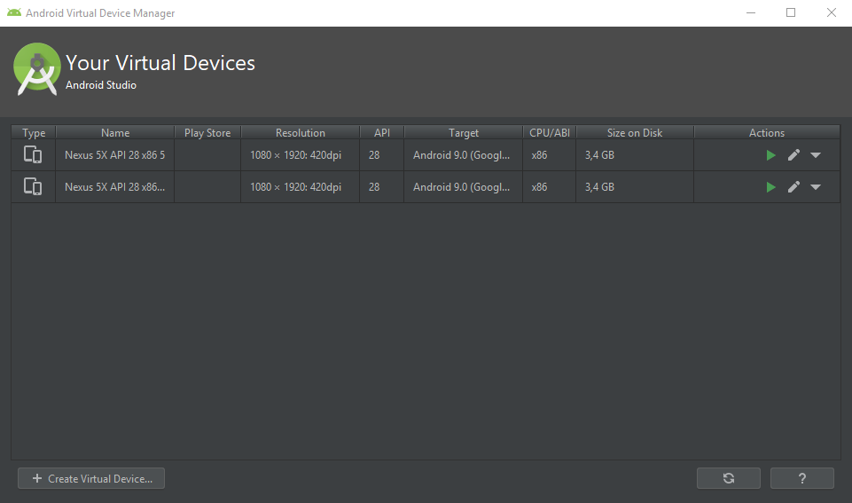
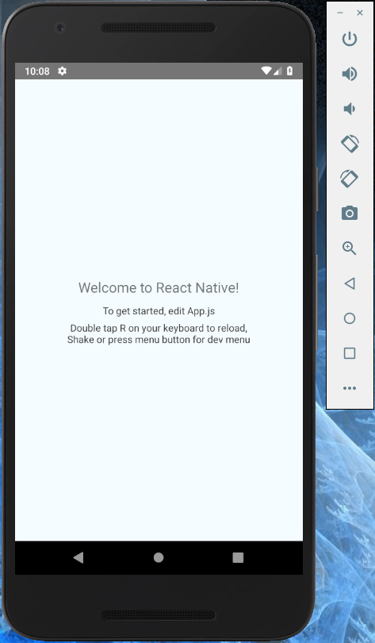

# Getting Started with ReactNative

## Installation

As described in https://facebook.github.io/react-native/docs/getting-started (ReactNative CLI Quickstart tab):
1. Install the following:
- Java JDK 8
- Node.js 10.15.3
- Android Studio 3 with Android SDK
- React Native CLI   
**Notes:**
- it is not necessary to use *Chocolatey* (all installations can be done manually)
2. Create a new ReactNative app, e.g.
>react-native init MyReactNativeApp

## Run your app on a virtual device
1. Create and run the Android Virtual Device (AVD) from Android Studio   
**Notes:**
- the AVD should already be there, auto-created by the installation
- to run, open the AVD Manager in Android Studio (from the *Configure* menu on the bottom of the start screen), then click on the green triangle besides the AVD entry, see below     

2. cd to the top-level folder of your ReactNative app, e.g.
>cd c:\applications\MyReactNativeApp
3. upload and start the app on the AVD with the command
>react-native run-android

Using the initially created application from above the emulation should look like this: 

**Possible issues**
- In case the application fails to load in the emulator with a red error screen and a message like   
`Error: Unable to resolve module './index' from 'MyReactNativeApp\node_modules\react-native\scripts/.': The module './index' could not be found from 'MyReactNativeApp\node_modules\react-native\scripts/.'. Indeed, none of these files exist: 
'MyReactNativeApp\node_modules\react-native\scripts\index(.native||.android.js|.native.js|.js|.android.json|.native.json|.json|.android.ts|.native.ts|.ts|.android.tsx|.native.tsx|.tsx)'`   
it might help to first execute the command
>npm start -- --reset-cache

and only then
>react-native run-android

## Set up the initial ExpoApp React Native work project

1. Fetch the starter project from GIT using the repository url
git@git.{yourcompany}.com:{yourappname}/starter-projects/react-native/react-native-starter.git

2. Install the necessary runtime libraries  
- navigate to the top-level folder of the locally created project and execute
>npm install

3. Test if everything runs as expected
- start a fresh AVD (see above)
- navigate to the top-level project folder and run the app:
>react-native run-android

This should bring up an emulation screen like in the image above. 
